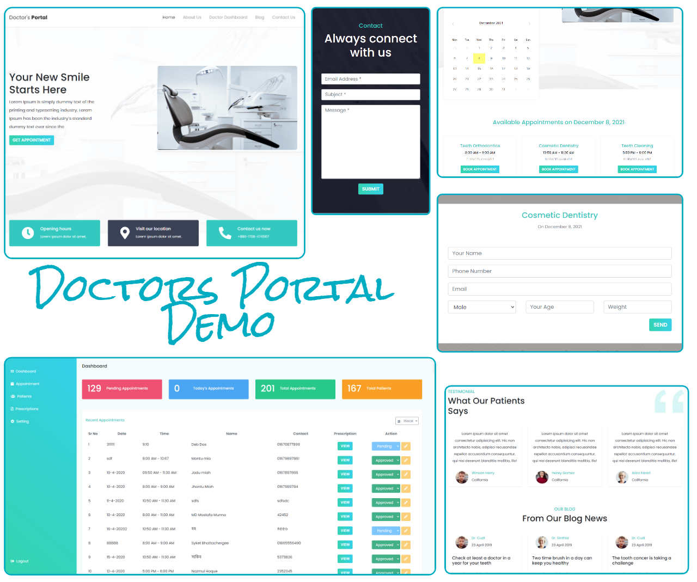

# Doctor's Portal

A single page demo web application with dashboard where patients can pick the date and time and fix an appointment. A doctor can review his appointments and prescribe medicine to his patients from his dashboard.

### **[Live Site](https://doctors-portal-react.firebaseapp.com/)**

### Features
* Online appointment making
* Patients Database
* Review appointments
* Prescribe medicine for each patient

### Front-end
* React.js
* Bootstrap4
* CSS3

### Back-end
* Node.js
* Express.js
* MongoDB
* Firebase
* Heroku

### **[Front-end Repository](https://github.com/Arafat-yousuf/doctors-portal/)**
